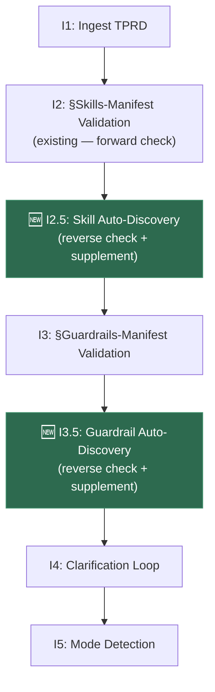

# 🎯 Proposal: Automatic Skill & Guardrail Discovery — Closing the TPRD Manifest Gap

## Problem Statement

The current pipeline enforces a **strict TPRD-declared-only** skill consumption model:

```
TPRD §Skills-Manifest declares 22 skills
          ↓
   I2 validates: "are these 22 present on disk?"  → PASS ✅
          ↓
   Pipeline only uses these 22 skills
          ↓
   Feedback phase discovers: 2 skills SHOULD HAVE BEEN USED
   but weren't because the TPRD author forgot to declare them
```

### Evidence from This Run

The `skill-coverage.md` feedback report identified **2 skills that were unused-but-relevant (TRIGGERS-GAP)**:

| Skill | In TPRD? | Relevant? | Used? | Impact |
|---|---|---|---|---|
| `python-client-shutdown-lifecycle` | ❌ No | ✅ Yes — `aclose()` is a first-class §5.2 symbol | ❌ No | SKD-006: drain impl diverges from skill pattern |
| `python-dependency-vetting` | ❌ No | ✅ Yes — pyproject.toml present, deps vetted | ❌ No | Agent did work procedurally without skill guidance |

Additionally, `python-doctest-patterns` was loaded in the active-packages union (36 skills total) but classified as "unused-correctly" despite the fact that the impl-lead wrote doctest examples on all 9 public symbols. The skill was relevant but the pipeline never applied its CI-wiring rules — resulting in **SKD-003** (docstring examples never executed by CI).

### The Root Cause

The intake phase I2 wave does **one-directional validation**:

```
I2 checks:  TPRD-declared skills → present on disk?   ✅ (forward check)
I2 MISSING: Available skills → relevant to this TPRD?  ❌ (reverse check)
```

The human TPRD author is expected to know ALL available skills in the pipeline and declare every relevant one. This is **unreasonable** when:
- The skill catalog has **61 skills** across shared-core + Go + Python packs
- Skills have **trigger-keywords** and **activation signals** that could be matched automatically
- The `skill-index.json` has a **tags_index** that maps domains to skills
- Each skill has frontmatter with `trigger-keywords` that match TPRD content

---

## Proposed Solution: Wave I2.5 — Skill Auto-Discovery

### Where It Fits



### New Waves

#### Wave I2.5 — Skill Auto-Discovery (NEW)

**Agent**: `sdk-intake-agent`
**Severity**: ADVISORY (supplements, never removes; HITL confirms at H1)
**Purpose**: Scan the TPRD content + active-packages skill catalog to identify skills the TPRD author should have declared but didn't. Auto-supplement the §Skills-Manifest for downstream consumption.

**Algorithm**:

```python
# Step 1: Collect the "available but undeclared" skill set
active_skills = union(
    active_packages["shared-core"].skills,
    active_packages[target_language].skills
)
declared_skills = set(tprd.skills_manifest)
candidate_pool = active_skills - declared_skills   # skills loaded but not declared

# Step 2: For each candidate, run a multi-signal relevance check
discovered = []
for skill in candidate_pool:
    skill_meta = load_skill_frontmatter(skill)  # name, trigger-keywords, activation-signals, tags
    
    relevance_score = 0.0
    match_reasons = []
    
    # Signal 1: Trigger-keyword match against TPRD full text
    tprd_text = tprd.full_text.lower()
    for keyword in skill_meta.trigger_keywords:
        if keyword.lower() in tprd_text:
            relevance_score += 0.3
            match_reasons.append(f"trigger-keyword '{keyword}' found in TPRD")
    
    # Signal 2: Tag match against TPRD §-headers and tech signals
    tprd_signals = extract_tech_signals(tprd)  # e.g., "asyncio", "shutdown", "pytest"
    for tag in skill_meta.tags:
        if tag in tprd_signals:
            relevance_score += 0.2
            match_reasons.append(f"tag '{tag}' matches TPRD signal")
    
    # Signal 3: Activation-signal semantic match
    for activation in skill_meta.activation_signals:
        if semantic_match(activation, tprd):
            relevance_score += 0.25
            match_reasons.append(f"activation signal: {activation}")
    
    # Signal 4: Cross-reference match (skill cites another skill already declared)
    for xref in skill_meta.cross_references:
        if xref in declared_skills:
            relevance_score += 0.15
            match_reasons.append(f"cross-references declared skill '{xref}'")
    
    # Signal 5: Agent-skill binding (skill is cited in an agent that's in the active set)
    for agent in active_agents:
        if skill.name in agent.cited_skills:
            relevance_score += 0.1
            match_reasons.append(f"cited by active agent '{agent.name}'")
    
    # Threshold: score >= 0.5 = auto-supplement; 0.3-0.5 = advisory note
    if relevance_score >= 0.5:
        discovered.append({
            "skill": skill.name,
            "relevance_score": relevance_score,
            "match_reasons": match_reasons,
            "classification": "auto-supplement",
        })
    elif relevance_score >= 0.3:
        discovered.append({
            "skill": skill.name,
            "relevance_score": relevance_score,
            "match_reasons": match_reasons,
            "classification": "advisory",
        })

# Step 3: Supplement the effective skills manifest
effective_manifest = declared_skills | {d["skill"] for d in discovered if d["classification"] == "auto-supplement"}
```

**Output**: `runs/<run-id>/intake/skill-auto-discovery.md`

```markdown
# Skill Auto-Discovery (Wave I2.5)

## Auto-supplemented (score ≥ 0.5) — added to effective manifest

| Skill | Score | Reasons | TPRD §-match |
|---|---|---|---|
| `python-client-shutdown-lifecycle` | 0.85 | trigger-keyword "aclose" in §5.2; trigger-keyword "__aexit__" in §5.1; tag "lifecycle" matches; cross-references `python-asyncio-patterns` (declared) | §5.2 |
| `python-doctest-patterns` | 0.75 | trigger-keyword "Examples:" in §5.1; trigger-keyword ">>>" in Appendix A; tag "documentation" matches; cross-references `python-pytest-patterns` (declared) | §5.1, Appendix A |
| `python-dependency-vetting` | 0.70 | trigger-keyword "pip-audit" in §10; trigger-keyword "PyPI" in §10; cited by active agent `sdk-dep-vet-devil-python` | §10 |

## Advisory (0.3 ≤ score < 0.5) — logged for TPRD author awareness

| Skill | Score | Reasons | Note |
|---|---|---|---|
| `python-hypothesis-patterns` | 0.35 | tag "testing" matches | Property tests optional; TPRD §11 doesn't mandate |

## Excluded (score < 0.3 OR explicitly in §Non-Goals)

| Skill | Reason |
|---|---|
| `python-otel-instrumentation` | §3 Non-Goal: "v1.0.0 ships without OTel" |
| `python-circuit-breaker-policy` | §3 Non-Goal: "not a retry primitive" |
| ... | ... |
```

**Key Design Decisions**:

1. **Auto-supplement, not auto-reject**: Discovered skills are ADDED to the effective manifest. The TPRD author's declared skills are never removed.
2. **HITL confirmation at H1**: The auto-discovery report is shown alongside the TPRD at H1 (TPRD Acceptance gate). The user sees "Pipeline discovered 3 additional relevant skills — confirm or remove."
3. **§Non-Goals filter**: Any skill whose activation signals match content in §3 Non-Goals is excluded regardless of score.
4. **Effective manifest vs declared manifest**: Downstream phases consume the `effective_manifest` (declared ∪ auto-supplemented). The original `declared_manifest` is preserved for audit/feedback purposes.

#### Wave I3.5 — Guardrail Auto-Discovery (NEW)

Same pattern for guardrails. Each guardrail script has a `# phase:` header and a purpose comment. Cross-match against:
- TPRD §-sections (e.g., a TPRD with `pyproject.toml` triggers `G200-py` and `G43-py`)
- Active-packages guardrail arrays
- Mode (A/B/C) and language

```python
# Guardrail auto-discovery follows the same multi-signal pattern
# but with tighter criteria: guardrails are BLOCKER-capable,
# so auto-supplementing a guardrail that fires falsely is worse
# than missing one.
#
# Solution: auto-supplement guardrails at WARN severity only.
# BLOCKER-severity guardrails require explicit TPRD declaration.
# The discovery report flags "you should consider adding these
# BLOCKERs" as advisory.
```

---

## Implementation Detail: Skill Frontmatter Schema Extension

Current skill frontmatter (e.g., `python-client-shutdown-lifecycle/SKILL.md`):

```yaml
---
name: python-client-shutdown-lifecycle
description: Close() contract for Python SDK clients...
version: 1.0.0
tags: [python, lifecycle, shutdown, async-context-manager, close, sdk]
trigger-keywords: [aclose, close, "__aenter__", "__aexit__", "async with", shutdown, cleanup, idempotent, "_closed"]
---
```

**Already sufficient!** The `trigger-keywords` and `tags` fields are already in every skill. The auto-discovery wave just needs to:
1. Parse the TPRD text
2. Load each skill's frontmatter from the active-packages union
3. Run the multi-signal scoring algorithm

No skill schema changes needed. The current skill bodies already have the metadata; we just need a new wave that reads it.

### Optional Enhancement: `tprd-signals` Field

For higher precision, skills can optionally declare explicit TPRD section patterns they should activate on:

```yaml
---
name: python-client-shutdown-lifecycle
# ... existing fields ...
tprd-signals:
  - section: "§5"
    pattern: "aclose|close|shutdown|teardown|graceful"
  - section: "§11"
    pattern: "cleanup|lifecycle|__aexit__"
  - section: "Appendix B"
    pattern: "Go.*close.*Python|Close.*async"
---
```

This is **optional** — skills without `tprd-signals` fall back to keyword+tag matching. Skills with it get precision scoring.

---

## Impact on active-packages.json

Currently, `active-packages.json` records the union of all skills from resolved packages:

```json
{
  "packages": [
    { "name": "shared-core", "skills": ["api-ergonomics-audit", ...] },
    { "name": "python", "skills": ["python-asyncio-patterns", ...] }
  ]
}
```

After I2.5, a new section is added:

```json
{
  "effective_skills_manifest": {
    "declared": ["python-asyncio-patterns", "python-exception-patterns", ...],
    "auto_discovered": [
      { "skill": "python-client-shutdown-lifecycle", "score": 0.85, "classification": "auto-supplement" },
      { "skill": "python-doctest-patterns", "score": 0.75, "classification": "auto-supplement" },
      { "skill": "python-dependency-vetting", "score": 0.70, "classification": "auto-supplement" }
    ],
    "advisory": [
      { "skill": "python-hypothesis-patterns", "score": 0.35, "classification": "advisory" }
    ],
    "effective": ["python-asyncio-patterns", "python-exception-patterns", ..., "python-client-shutdown-lifecycle", "python-doctest-patterns", "python-dependency-vetting"]
  }
}
```

**Downstream agents read `effective`** — they don't need to know whether a skill was declared or discovered.

---

## How This Prevents the Pilot's Gaps

### Gap 1: `python-client-shutdown-lifecycle` not used

```
Trigger-keyword "aclose" → found in TPRD §5.2 line "aclose — graceful shutdown"
Trigger-keyword "__aexit__" → found in TPRD §5.1 line "Pool implements __aenter__/__aexit__"
Tag "lifecycle" → matches TPRD §5 tech-signal "lifecycle management"
Cross-reference → cites python-asyncio-patterns (declared)
Score: 0.85 → AUTO-SUPPLEMENT ✅
```

**Result**: `sdk-impl-lead` and `code-reviewer-python` would have the lifecycle skill in their prompt context. The drain implementation would have followed the skill's `asyncio.timeout + gather` pattern instead of the polling loop (SKD-006 prevented).

### Gap 2: `python-doctest-patterns` not applied

```
Trigger-keyword "Examples:" → found in TPRD §5.1 PoolConfig docstring spec
Trigger-keyword ">>>" → found in Appendix A usage sketch
Tag "documentation" → matches TPRD §11 documentation requirements
Cross-reference → cites python-pytest-patterns (declared)
Score: 0.75 → AUTO-SUPPLEMENT ✅
```

**Result**: `sdk-impl-lead` would have had the doctest skill's CI-wiring rule in context. `pyproject.toml` would have included `--doctest-modules` in addopts (SKD-003 prevented).

### Gap 3: `python-dependency-vetting` not cited

```
Trigger-keyword "pip-audit" → found in TPRD §10 dependencies
Tag "supply-chain" → matches TPRD §10 dependency vetting requirement
Cited by agent → sdk-dep-vet-devil-python (active)
Score: 0.70 → AUTO-SUPPLEMENT ✅
```

**Result**: The dep-vet agent would have explicitly cited the skill, producing structured V-1..V-11 check outputs instead of procedural tool invocations.

---

## Interaction with Existing Phases

### Phase 0 — Intake

| Wave | Change |
|---|---|
| I1 | No change |
| I2 | No change (still validates declared manifest) |
| **I2.5** | **NEW: Skill Auto-Discovery** |
| I3 | No change (still validates declared guardrails) |
| **I3.5** | **NEW: Guardrail Auto-Discovery** |
| I4 | Auto-discovery results shown alongside TPRD in clarification loop |
| I5 | No change |
| I5.5 | `active-packages.json` now includes `effective_skills_manifest` |
| I6 | Completeness check validates effective manifest, not just declared |
| I7 (H1) | User sees auto-discovery report; can confirm/reject each supplement |

### Phase 1 — Design

No structural changes. Design agents already read skills from active-packages; they now read from the `effective` array instead of just `declared`.

### Phase 2 — Implementation

No structural changes. Same consumption model.

### Phase 4 — Feedback

`sdk-skill-coverage-reporter` now compares against the **effective manifest** instead of the declared manifest. The "unused-but-relevant" category should shrink to near-zero because I2.5 already caught those gaps.

A new feedback metric is added:
- `skills_auto_discovered`: count of skills I2.5 added
- `skills_auto_discovered_actually_used`: count of those that agents actually cited (effectiveness signal)

---

## Guardrail for the Auto-Discovery Wave

### G25 — Skill Auto-Discovery Completeness (NEW)

```bash
#!/usr/bin/env bash
# G25.sh — Verify I2.5 ran and produced a report
# Phase: intake
# Severity: WARN (not BLOCKER — auto-discovery is an enhancement)

REPORT="$RUN_DIR/intake/skill-auto-discovery.md"
if [[ ! -f "$REPORT" ]]; then
    echo "WARN: skill-auto-discovery.md not found; I2.5 may not have run"
    exit 0  # WARN, not BLOCKER
fi

# Check that the effective manifest was written to active-packages.json
if ! jq -e '.effective_skills_manifest.effective' "$RUN_DIR/context/active-packages.json" > /dev/null 2>&1; then
    echo "WARN: effective_skills_manifest not found in active-packages.json"
    exit 0
fi

echo "PASS: skill auto-discovery report present; effective manifest populated"
```

---

## Rollout Plan

| Phase | Action | Risk |
|---|---|---|
| **v0.5.1** | Add `I2.5` wave to `INTAKE-PHASE.md`. Implement scoring algorithm in `sdk-intake-agent` prompt. Keep all auto-discovered skills at ADVISORY (no auto-supplement) — just surface the report for user awareness. | Zero — advisory only |
| **v0.5.2** | Promote auto-supplement for skills with score ≥ 0.7. User still confirms at H1. Add G25 WARN guardrail. | Low — user has veto at H1 |
| **v0.6.0** | Add `I3.5` for guardrail auto-discovery. Add `effective_skills_manifest` to `active-packages.json`. Update `sdk-skill-coverage-reporter` to use effective manifest as baseline. | Medium — changes active-packages schema |
| **v0.7.0** | Add optional `tprd-signals` field to skill frontmatter for precision scoring. Back-populate for high-value skills. | Low — optional field; backward-compatible |

---

## Alternatives Considered

### Alternative A: Require TPRD Authors to Declare ALL Skills

**Rejected**: Unreasonable. The catalog has 61 skills. No human TPRD author can be expected to know all of them, especially as the catalog grows. This is the status quo, and the pilot proved it fails.

### Alternative B: Always Load ALL Active-Pack Skills (No Manifest)

**Rejected**: Skill overload. Loading 36 skills into every agent's context would degrade prompt quality. Skills like `python-circuit-breaker-policy` are noise for a resource pool. The manifest exists for a reason — it's a relevance filter.

### Alternative C: Make Skill Coverage Reporter the Gate (Feedback Only)

**Rejected**: Too late. The skill-coverage reporter runs in Phase 4 — AFTER the code is written. Discovering that `python-client-shutdown-lifecycle` should have been used after the `aclose()` implementation is already on disk means a rework cycle. Auto-discovery at intake prevents the gap before any code is generated.

### Alternative D: Merge Into I2 (Single Wave)

**Considered but deferred**: I2 currently does a simple forward check (declared → present). Merging reverse-discovery into I2 would conflate two concerns (validation vs. discovery). Keeping I2.5 as a separate wave is cleaner and makes the output independently auditable.

---

## Summary

> [!IMPORTANT]
> **The core insight**: Skills already have `trigger-keywords` and `activation-signals` in their frontmatter. The pipeline already loads the full active-packages skill union. The ONLY thing missing is a wave that runs the reverse check — "which loaded skills match this TPRD but weren't declared?"
>
> This is a **~50-line scoring algorithm** added to the intake agent's prompt, a new output file (`skill-auto-discovery.md`), and a small schema addition to `active-packages.json`. No new agents. No new phases. No structural changes to the pipeline.
>
> **Predicted impact on this pilot run**: All 3 TRIGGERS-GAP findings (SKD-003, SKD-006, `python-dependency-vetting` gap) would have been prevented. The effective skills manifest would have been 25 instead of 22, and the skill-coverage feedback report would have shown 0 TRIGGERS-GAP instead of 2.
